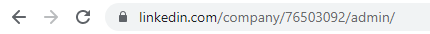
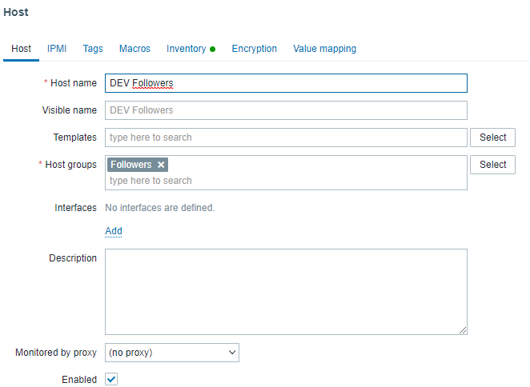
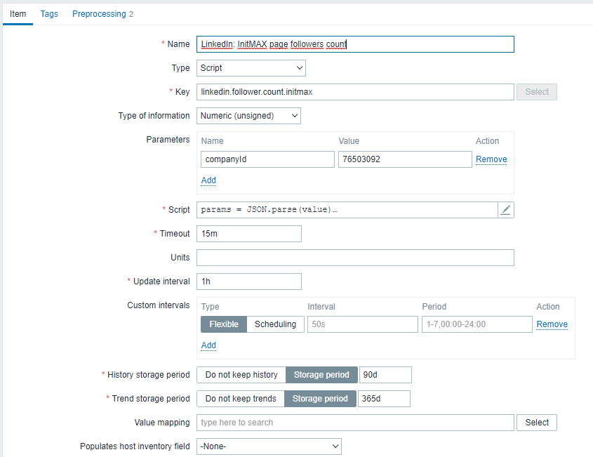
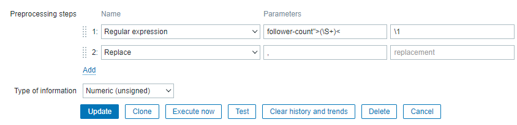
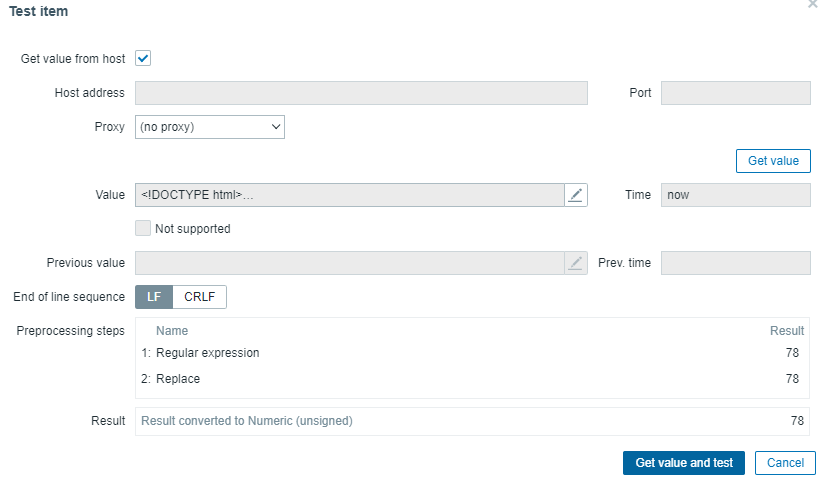

# How to get LinkedIn profile followers count with Zabbix

A common way to get information about social media profiles is to use the API. However, this usually requires sifting through a more or less complicated process of obtaining an API Token. Here's a demonstration of how to do it in Zabbix without API.

Here are two ways how this can be done:

- [with template](#templates)  
or  
- [manual configuration](#manual-configuration)

## Templates
Just ⬆️ download ⬆️ and import template for your version of Zabbix and its done. 🙂  

`Followers-LinkedIn-520.yaml` - template for Zabbix 5.2.0  
`Followers-LinkedIn-540.yaml` - template for Zabbix 5.4.0 and above


## Manual configuration

### Obtaining a company id

The first thing we will need is a LinkedIn company ID.  
One option is to follow the official official LinkedIn documentation:

> As a company page administrator, your Company ID can be retrieved by navigating to the admin section of your company page. For example, the LinkedIn Company Admin Page is 
> https://www.linkedin.com/company/0000/admin/. We will use the Company ID 0000 in our example.

In our case we get company ID: 76503092



### Host creation

The next step in this demonstration is to create a basic dummy host to monitor the number of followers.

**Host**: Followers

**Host groups**: Followers



### Item creation

And now let's create the item itself.

**Name:** LinkedIn: InitMAX page followers count

**Key:** linkedin.follower.count.initmax

**Parameters:** 
|  Name       | Value       |
| ----------- | ----------- |
| companyId   | 76503092    | 

**Script:**  
For version 5.2.0 
```javascript
params = JSON.parse(value)

var request = new CurlHttpRequest();
return request.Get("https://www.linkedin.com/pages-extensions/FollowCompany?id=" + params.companyId + "&counter=bottom");
```
For versions > 5.4.0
```javascript
params = JSON.parse(value)

var request = new HttpRequest();
return request.get("https://www.linkedin.com/pages-extensions/FollowCompany?id=" + params.companyId + "&counter=bottom");
```
*The reason why two versions are needed is that zabbix has changed the naming convention since version 5.4.0. Details can be found here: [What's new in Zabbix 5.4.0](https://www.zabbix.com/documentation/5.4/en/manual/introduction/whatsnew540)  - JavaScript objects*  

**Update interval:** 15m



### Preprocessing

In this case, we must also create preprocessing.

|  Name       | Parameters              |
| ----------- | ----------- | ----------- |
| Regular expression: | follower-count">(\S+)< | \1
| Replace: | , | leave blank



### Testing and banana moment

And we're almost done, now let's test the item.

Clik on **Test** button and then click on **Get value and test** and ..... BANANA 🍌 🙂 (thanks [Steve DESTIVELLE](https://www.linkedin.com/in/steve-destivelle-88b6b389/) )



### APIend

Now save the item and you are done. 

Enjoy the growing numbers of folowers on LinkedIn profile without API.🙂  

  
---  
**Like, share and follow us** 😍 for more content:  
- [LinkedIn](https://www.linkedin.com/company/initmax/)🔥
- [Twitter](https://twitter.com/initmax1)
- [Instagram](https://www.instagram.com/initmax/)
- [Facebook](https://www.facebook.com/initmax)
- [Web](https://www.initmax.cz/)
- [Youtube](https://www.youtube.com/@initmax1)
